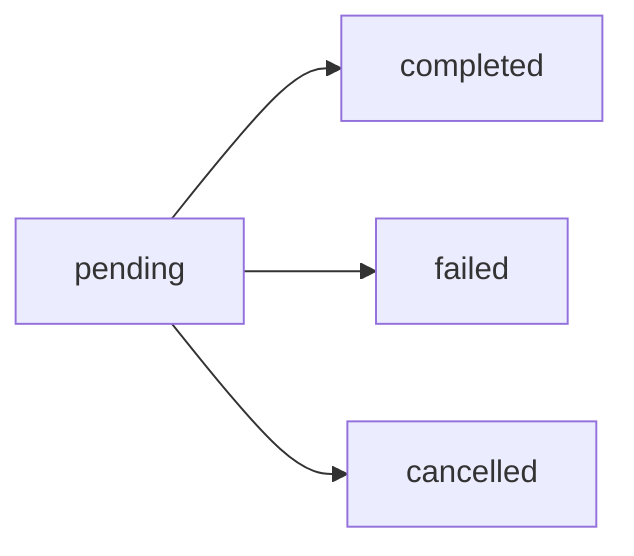

# Objeto transaction

Representa uma transação PIX no sistema PrimePix.

## Estrutura

```json
{
  "transactionId": 12345,
  "externalId": "order_123",
  "amount": 100.00,
  "fee": 2.50,
  "netAmount": 97.50,
  "status": "completed",
  "description": "Payment for order #123",
  "qrCode": "00020126580014br.gov.bcb.pix...",
  "qrCodeBase64": "iVBORw0KGgoAAAANSUhEUgAA...",
  "customer": {
    "name": "João Silva",
    "document": "12345678900",
    "email": "joao@example.com",
    "phone": "+5511999999999"
  },
  "pix": {
    "endToEndId": "E12345678202401151030123456789",
    "txId": "7d9f0335d46d4fe4bc55b5c17f",
    "payer": {
      "name": "João Silva",
      "document": "12345678900"
    }
  },
  "createdAt": "2024-01-15T10:00:00Z",
  "paidAt": "2024-01-15T10:15:30Z",
  "updatedAt": "2024-01-15T10:15:30Z"
}
```

## Propriedades

<ResponseField name="transactionId" type="integer" required>
  Identificador único da transação no sistema PrimePix.
</ResponseField>

<ResponseField name="externalId" type="string">
  Seu identificador externo para referência. Útil para vincular com seu sistema.
</ResponseField>

<ResponseField name="amount" type="number" required>
  Valor da transação em reais (BRL).
</ResponseField>

<ResponseField name="fee" type="number" required>
  Taxa cobrada pela transação em reais (BRL).
</ResponseField>

<ResponseField name="netAmount" type="number" required>
  Valor líquido que você receberá (amount - fee).
</ResponseField>

<ResponseField name="status" type="string" required>
  Status atual da transação. Valores possíveis:
  - `pending` - Aguardando pagamento
  - `completed` - Pagamento confirmado
  - `failed` - Pagamento falhou ou expirou
  - `cancelled` - Pagamento cancelado
</ResponseField>

<ResponseField name="description" type="string">
  Descrição da transação fornecida na criação.
</ResponseField>

<ResponseField name="qrCode" type="string">
  Código PIX copia e cola (disponível apenas para transações pendentes).
</ResponseField>

<ResponseField name="qrCodeBase64" type="string">
  Imagem do QR Code em formato base64 (disponível apenas para transações pendentes).
</ResponseField>

<ResponseField name="customer" type="object">
  Informações do cliente. Veja [objeto customer](/api-reference/objects/customer).
</ResponseField>

<ResponseField name="pix" type="object">
  Informações específicas do PIX. Veja [objeto pix](/api-reference/objects/pix).
</ResponseField>

<ResponseField name="createdAt" type="string" required>
  Data e hora de criação da transação (ISO 8601).
</ResponseField>

<ResponseField name="paidAt" type="string">
  Data e hora do pagamento (ISO 8601). Disponível apenas para transações completadas.
</ResponseField>

<ResponseField name="updatedAt" type="string" required>
  Data e hora da última atualização (ISO 8601).
</ResponseField>

## Ciclo de vida



1. **pending** - Transação criada, aguardando pagamento do cliente
2. **completed** - Pagamento confirmado e processado
3. **failed** - Pagamento expirou ou falhou
4. **cancelled** - Transação cancelada manualmente

## Exemplo de uso

### Criar e verificar transação

```javascript Node.js
// Criar transação
const createResponse = await fetch('https://api.primepix.me/v1/pix/create', {
  method: 'POST',
  headers: {
    'X-API-Key': 'your_api_key',
    'X-API-Secret': 'your_api_secret',
    'Content-Type': 'application/json'
  },
  body: JSON.stringify({
    amount: 100.00,
    description: 'Pagamento pedido #123',
    externalId: 'order_123'
  })
});

const { data: transaction } = await createResponse.json();
console.log('Transaction ID:', transaction.transactionId);
console.log('Status:', transaction.status);

// Verificar status
const statusResponse = await fetch(
  `https://api.primepix.me/v1/pix/status/${transaction.transactionId}`,
  {
    headers: {
      'X-API-Key': 'your_api_key',
      'X-API-Secret': 'your_api_secret'
    }
  }
);

const { data: updatedTransaction } = await statusResponse.json();
console.log('Updated status:', updatedTransaction.status);
```

## Relacionado

- [Criar transação PIX](/api-reference/pix/create)
- [Consultar status](/api-reference/pix/status)
- [Objeto customer](/api-reference/objects/customer)
- [Objeto pix](/api-reference/objects/pix)
