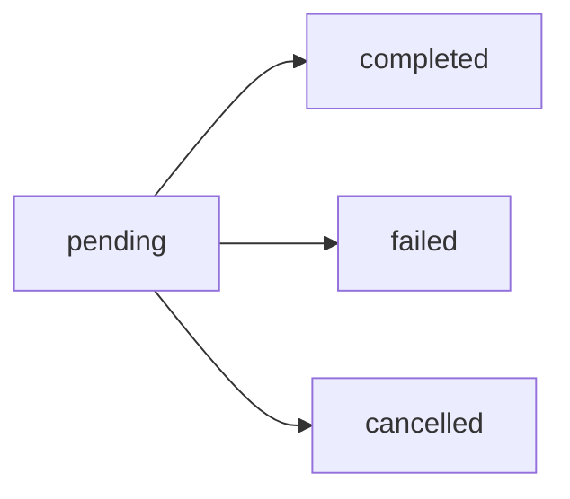

# Get payment status

`GET /api/v1/pix/status/{id}`

Retrieves the current status of a PIX payment transaction.

## Request

### Headers

| Header | Type | Required | Description |
|--------|------|----------|-------------|
| `X-API-Key` | string | Yes | Your API key |
| `X-API-Secret` | string | Yes | Your API secret |

### Path parameters

<ParamField path="id" type="string" required>
  The transaction identifier. Can be one of:
  - Internal transaction ID
  - Your external ID
  - VersellPay transaction ID
</ParamField>

## Response

<ResponseField name="success" type="boolean">
  Indicates if the request was successful.
</ResponseField>

<ResponseField name="data" type="object">
  The transaction data.
  
  <Expandable title="data properties">
    <ResponseField name="transactionId" type="integer">
      Unique transaction identifier.
    </ResponseField>
    
    <ResponseField name="externalId" type="string">
      Your external reference ID.
    </ResponseField>
    
    <ResponseField name="amount" type="number">
      The charge amount.
    </ResponseField>
    
    <ResponseField name="fee" type="number">
      Transaction fee charged.
    </ResponseField>
    
    <ResponseField name="netAmount" type="number">
      Net amount you'll receive (amount - fee).
    </ResponseField>
    
    <ResponseField name="status" type="string">
      Current transaction status. Possible values:
      - `pending` - Waiting for payment
      - `completed` - Payment received
      - `failed` - Payment failed or expired
      - `cancelled` - Payment cancelled
    </ResponseField>
    
    <ResponseField name="qrCode" type="string">
      PIX code string (only for pending payments).
    </ResponseField>
    
    <ResponseField name="qrCodeBase64" type="string">
      Base64-encoded QR code image (only for pending payments).
    </ResponseField>
    
    <ResponseField name="paidAt" type="string">
      ISO 8601 timestamp when payment was completed (only for completed payments).
    </ResponseField>
    
    <ResponseField name="createdAt" type="string">
      ISO 8601 timestamp when transaction was created.
    </ResponseField>
    
    <ResponseField name="customer" type="object">
      Customer information.
      
      <Expandable title="customer properties">
        <ResponseField name="name" type="string">
          Customer's full name.
        </ResponseField>
        
        <ResponseField name="document" type="string">
          Customer's CPF or CNPJ.
        </ResponseField>
        
        <ResponseField name="email" type="string">
          Customer's email address.
        </ResponseField>
        
        <ResponseField name="phone" type="string">
          Customer's phone number.
        </ResponseField>
      </Expandable>
    </ResponseField>
  </Expandable>
</ResponseField>

## Example

<CodeGroup>

```bash cURL
curl -X GET https://your-domain.com/api/v1/pix/status/12345 \
  -H "X-API-Key: your_api_key" \
  -H "X-API-Secret: your_api_secret"
```

```javascript Node.js
const response = await fetch('https://your-domain.com/api/v1/pix/status/12345', {
  headers: {
    'X-API-Key': 'your_api_key',
    'X-API-Secret': 'your_api_secret'
  }
});

const data = await response.json();
console.log(data);
```

```python Python
import requests

response = requests.get(
    'https://your-domain.com/api/v1/pix/status/12345',
    headers={
        'X-API-Key': 'your_api_key',
        'X-API-Secret': 'your_api_secret'
    }
)

data = response.json()
print(data)
```

```php PHP
<?php
$ch = curl_init('https://your-domain.com/api/v1/pix/status/12345');

curl_setopt($ch, CURLOPT_RETURNTRANSFER, true);
curl_setopt($ch, CURLOPT_HTTPHEADER, [
    'X-API-Key: your_api_key',
    'X-API-Secret: your_api_secret'
]);

$response = curl_exec($ch);
curl_close($ch);

$data = json_decode($response, true);
print_r($data);
?>
```

</CodeGroup>

### Response (pending payment)

```json
{
  "success": true,
  "data": {
    "transactionId": 12345,
    "externalId": "order_123",
    "amount": 100.00,
    "fee": 2.50,
    "netAmount": 97.50,
    "status": "pending",
    "qrCode": "00020126580014br.gov.bcb.pix...",
    "qrCodeBase64": "iVBORw0KGgoAAAANSUhEUgAA...",
    "createdAt": "2024-01-15T10:00:00Z",
    "customer": {
      "name": "João Silva",
      "document": "12345678900",
      "email": "joao@example.com",
      "phone": "+5511999999999"
    }
  }
}
```

### Response (completed payment)

```json
{
  "success": true,
  "data": {
    "transactionId": 12345,
    "externalId": "order_123",
    "amount": 100.00,
    "fee": 2.50,
    "netAmount": 97.50,
    "status": "completed",
    "paidAt": "2024-01-15T10:15:30Z",
    "createdAt": "2024-01-15T10:00:00Z",
    "customer": {
      "name": "João Silva",
      "document": "12345678900",
      "email": "joao@example.com",
      "phone": "+5511999999999"
    }
  }
}
```

## Status codes

| Status | Description |
|--------|-------------|
| `200` | Transaction found |
| `401` | Invalid or missing authentication |
| `404` | Transaction not found |
| `500` | Internal server error |

## Common errors

### Transaction not found

```json
{
  "success": false,
  "error": "Transaction not found",
  "code": "TRANSACTION_NOT_FOUND"
}
```

## Payment status flow



1. **pending** - Payment is waiting for customer action
2. **completed** - Payment was successfully received
3. **failed** - Payment expired or failed
4. **cancelled** - Payment was manually cancelled

## Polling vs Webhooks

While you can poll this endpoint to check payment status, we recommend using [webhooks](/webhooks) for real-time notifications. This is more efficient and provides instant updates.

### Polling example

```javascript Node.js
async function waitForPayment(transactionId, maxAttempts = 60) {
  for (let i = 0; i < maxAttempts; i++) {
    const response = await fetch(
      `https://your-domain.com/api/v1/pix/status/${transactionId}`,
      {
        headers: {
          'X-API-Key': 'your_api_key',
          'X-API-Secret': 'your_api_secret'
        }
      }
    );
    
    const data = await response.json();
    
    if (data.data.status === 'completed') {
      return data.data;
    }
    
    if (data.data.status === 'failed' || data.data.status === 'cancelled') {
      throw new Error(`Payment ${data.data.status}`);
    }
    
    // Wait 5 seconds before next check
    await new Promise(resolve => setTimeout(resolve, 5000));
  }
  
  throw new Error('Payment timeout');
}
```

## Next steps

- [Set up webhooks](/webhooks) for real-time notifications
- [List all transactions](/api-reference/account/transactions)
- [Handle errors](/errors) properly
