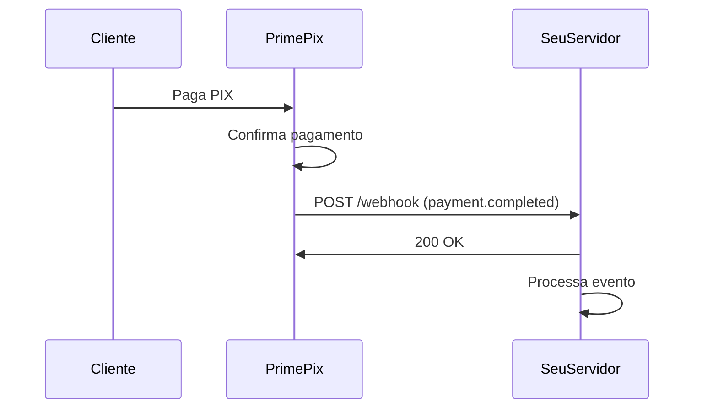

# Webhooks

Webhooks permitem que você receba notificações em tempo real quando eventos ocorrem em sua conta PrimePix, como pagamentos confirmados ou saques processados.

## Como funcionam

Quando um evento ocorre, o PrimePix envia uma requisição HTTP POST para a URL configurada com os detalhes do evento.



## Configuração

1. Acesse o [Dashboard PrimePix](https://app.primepix.me)
2. Navegue até **Configurações → Webhooks**
3. Adicione a URL do seu endpoint
4. Selecione os eventos que deseja receber
5. Salve a configuração

<Info>
  **URL deve ser HTTPS**
  
  Por segurança, apenas URLs HTTPS são aceitas para webhooks em produção.
</Info>

## Eventos disponíveis

### payment.completed

Disparado quando um pagamento PIX é confirmado.

```json
{
  "event": "payment.completed",
  "timestamp": "2024-01-15T10:30:00Z",
  "data": {
    "transactionId": 12345,
    "externalId": "order_123",
    "amount": 100.00,
    "fee": 2.50,
    "netAmount": 97.50,
    "status": "completed",
    "paidAt": "2024-01-15T10:29:45Z",
    "customer": {
      "name": "João Silva",
      "document": "12345678900",
      "email": "joao@example.com"
    },
    "pix": {
      "endToEndId": "E12345678202401151030123456789",
      "payer": {
        "name": "João Silva",
        "document": "12345678900"
      }
    }
  }
}
```

### payment.failed

Disparado quando um pagamento falha ou expira.

```json
{
  "event": "payment.failed",
  "timestamp": "2024-01-15T10:30:00Z",
  "data": {
    "transactionId": 12345,
    "externalId": "order_123",
    "amount": 100.00,
    "status": "failed",
    "reason": "expired",
    "createdAt": "2024-01-15T10:00:00Z"
  }
}
```

### withdrawal.completed

Disparado quando um saque é processado com sucesso.

```json
{
  "event": "withdrawal.completed",
  "timestamp": "2024-01-15T10:30:00Z",
  "data": {
    "withdrawalId": 67890,
    "amount": 500.00,
    "pixKey": "joao@example.com",
    "pixKeyType": "EMAIL",
    "status": "completed",
    "completedAt": "2024-01-15T10:29:45Z"
  }
}
```

### withdrawal.failed

Disparado quando um saque falha.

```json
{
  "event": "withdrawal.failed",
  "timestamp": "2024-01-15T10:30:00Z",
  "data": {
    "withdrawalId": 67890,
    "amount": 500.00,
    "status": "failed",
    "reason": "insufficient_balance"
  }
}
```

## Implementação

### Node.js (Express)

```javascript
const express = require('express');
const app = express();

app.post('/webhooks/primepix', express.json(), (req, res) => {
  const { event, data } = req.body;

  console.log(`Evento recebido: ${event}`);

  switch (event) {
    case 'payment.completed':
      handlePaymentCompleted(data);
      break;

    case 'payment.failed':
      handlePaymentFailed(data);
      break;

    case 'withdrawal.completed':
      handleWithdrawalCompleted(data);
      break;

    case 'withdrawal.failed':
      handleWithdrawalFailed(data);
      break;

    default:
      console.log(`Evento desconhecido: ${event}`);
  }

  // Sempre responda com 200 OK
  res.status(200).send('OK');
});

function handlePaymentCompleted(data) {
  console.log(`Pagamento ${data.transactionId} confirmado`);
  // Atualizar pedido no banco de dados
  // Enviar e-mail de confirmação
  // Liberar produto/serviço
}

function handlePaymentFailed(data) {
  console.log(`Pagamento ${data.transactionId} falhou: ${data.reason}`);
  // Notificar cliente
  // Cancelar pedido
}

app.listen(3000, () => {
  console.log('Servidor rodando na porta 3000');
});
```

### Python (Flask)

```python
from flask import Flask, request
import json

app = Flask(__name__)

@app.route('/webhooks/primepix', methods=['POST'])
def webhook():
    data = request.json
    event = data.get('event')
    event_data = data.get('data')

    print(f'Evento recebido: {event}')

    if event == 'payment.completed':
        handle_payment_completed(event_data)
    elif event == 'payment.failed':
        handle_payment_failed(event_data)
    elif event == 'withdrawal.completed':
        handle_withdrawal_completed(event_data)
    elif event == 'withdrawal.failed':
        handle_withdrawal_failed(event_data)
    else:
        print(f'Evento desconhecido: {event}')

    # Sempre responda com 200 OK
    return 'OK', 200

def handle_payment_completed(data):
    print(f"Pagamento {data['transactionId']} confirmado")
    # Atualizar pedido no banco de dados
    # Enviar e-mail de confirmação
    # Liberar produto/serviço

def handle_payment_failed(data):
    print(f"Pagamento {data['transactionId']} falhou: {data['reason']}")
    # Notificar cliente
    # Cancelar pedido

if __name__ == '__main__':
    app.run(port=3000)
```

### PHP

```php
<?php
// webhook.php

$payload = file_get_contents('php://input');
$data = json_decode($payload, true);

$event = $data['event'];
$eventData = $data['data'];

error_log("Evento recebido: {$event}");

switch ($event) {
    case 'payment.completed':
        handlePaymentCompleted($eventData);
        break;

    case 'payment.failed':
        handlePaymentFailed($eventData);
        break;

    case 'withdrawal.completed':
        handleWithdrawalCompleted($eventData);
        break;

    case 'withdrawal.failed':
        handleWithdrawalFailed($eventData);
        break;

    default:
        error_log("Evento desconhecido: {$event}");
}

// Sempre responda com 200 OK
http_response_code(200);
echo 'OK';

function handlePaymentCompleted($data) {
    error_log("Pagamento {$data['transactionId']} confirmado");
    // Atualizar pedido no banco de dados
    // Enviar e-mail de confirmação
    // Liberar produto/serviço
}

function handlePaymentFailed($data) {
    error_log("Pagamento {$data['transactionId']} falhou: {$data['reason']}");
    // Notificar cliente
    // Cancelar pedido
}
?>
```

## Segurança

### Verificar assinatura

Todos os webhooks incluem um header `X-Webhook-Signature` com uma assinatura HMAC-SHA256 do payload.

```javascript Node.js
const crypto = require('crypto');

function verifyWebhookSignature(payload, signature, secret) {
  const hmac = crypto.createHmac('sha256', secret);
  hmac.update(JSON.stringify(payload));
  const expectedSignature = hmac.digest('hex');
  
  return crypto.timingSafeEqual(
    Buffer.from(signature),
    Buffer.from(expectedSignature)
  );
}

app.post('/webhooks/primepix', express.json(), (req, res) => {
  const signature = req.headers['x-webhook-signature'];
  const webhookSecret = process.env.PRIMEPIX_WEBHOOK_SECRET;
  
  if (!verifyWebhookSignature(req.body, signature, webhookSecret)) {
    return res.status(401).send('Invalid signature');
  }
  
  // Processar webhook...
  res.status(200).send('OK');
});
```

### Validar origem

Verifique se a requisição vem dos IPs do PrimePix:

```
52.67.123.45
54.207.89.123
```

<Warning>
  **Sempre valide webhooks**
  
  Implemente verificação de assinatura para garantir que os webhooks são legítimos e não foram adulterados.
</Warning>

## Boas práticas

<AccordionGroup>
  <Accordion title="Responda rapidamente">
    Retorne `200 OK` imediatamente. Processe o evento de forma assíncrona em uma fila.
    
    ```javascript
    app.post('/webhooks/primepix', express.json(), async (req, res) => {
      // Responda imediatamente
      res.status(200).send('OK');
      
      // Processe depois
      await queue.add('process-webhook', req.body);
    });
    ```
  </Accordion>

  <Accordion title="Implemente idempotência">
    Webhooks podem ser enviados múltiplas vezes. Use o `transactionId` para evitar processamento duplicado.
    
    ```javascript
    async function handlePaymentCompleted(data) {
      const exists = await db.webhooks.findOne({
        transactionId: data.transactionId,
        event: 'payment.completed'
      });
      
      if (exists) {
        console.log('Webhook já processado');
        return;
      }
      
      // Processar...
      await db.webhooks.create({
        transactionId: data.transactionId,
        event: 'payment.completed',
        processedAt: new Date()
      });
    }
    ```
  </Accordion>

  <Accordion title="Registre todos os webhooks">
    Mantenha um log de todos os webhooks recebidos para auditoria e debugging.
  </Accordion>

  <Accordion title="Trate erros graciosamente">
    Se o processamento falhar, o PrimePix tentará reenviar o webhook automaticamente.
  </Accordion>

  <Accordion title="Use HTTPS">
    Sempre use HTTPS para proteger os dados em trânsito.
  </Accordion>
</AccordionGroup>

## Retentativas

Se seu endpoint não responder com `200 OK`, o PrimePix tentará reenviar o webhook:

- **1ª tentativa**: Imediatamente
- **2ª tentativa**: Após 5 minutos
- **3ª tentativa**: Após 30 minutos
- **4ª tentativa**: Após 2 horas
- **5ª tentativa**: Após 6 horas

Após 5 tentativas falhadas, o webhook é descartado e você receberá um alerta por e-mail.

## Testando webhooks

### Usando ngrok

Para testar localmente, use [ngrok](https://ngrok.com) para expor seu servidor:

```bash
# Inicie seu servidor local
npm start

# Em outro terminal, inicie o ngrok
ngrok http 3000
```

Use a URL HTTPS fornecida pelo ngrok no dashboard do PrimePix.

### Webhook de teste

Você pode enviar um webhook de teste através do dashboard:

1. Acesse **Configurações → Webhooks**
2. Clique em **Enviar teste**
3. Selecione o tipo de evento
4. Clique em **Enviar**

## Monitoramento

Acompanhe o status dos webhooks no dashboard:

- **Enviados**: Total de webhooks enviados
- **Sucesso**: Webhooks entregues com sucesso (200 OK)
- **Falhas**: Webhooks que falharam após todas as tentativas
- **Pendentes**: Webhooks aguardando retentativa

## Próximos passos

<CardGroup cols={2}>
  <Card title="Objetos de resposta" icon="brackets-curly" href="/api-reference/objects/transaction">
    Entenda a estrutura dos dados
  </Card>
  <Card title="Criar transação" icon="qrcode" href="/api-reference/pix/create">
    Comece a receber pagamentos
  </Card>
</CardGroup>
